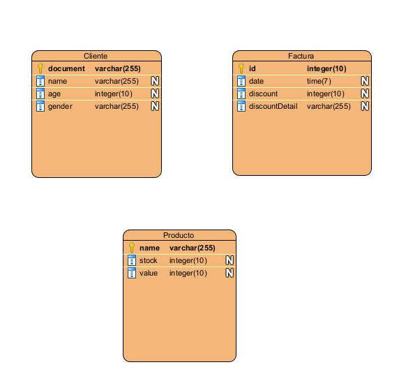
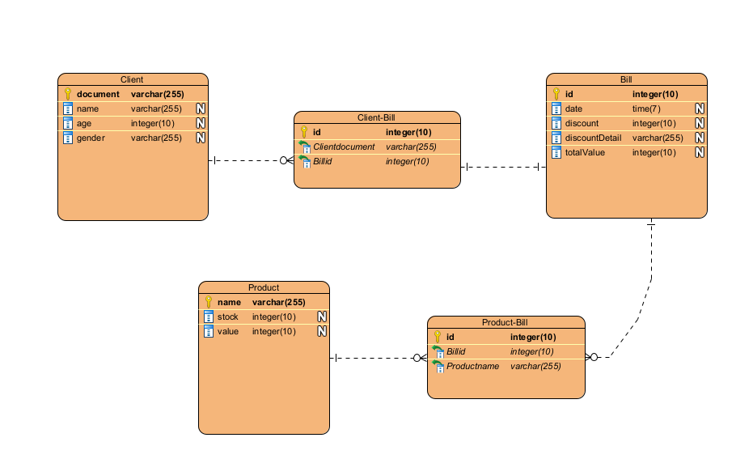

# Ejercicio practico de MER

Miremos con un ejemplo practico la realización de un MER, para este caso vamos a utilizar el modelo de tablas que es el mas empleado en el ambito profesional.

Para este ejercicio vamos a modelar el siguiente caso de negocio.

Don Sultano tiene una tienda de barrio, en esta tienda el maneja todos sus informes y cuentas a mano, al ver el esfuerzo que le toma hacer todas estas operaciones decides ofrecerle sistematizar su tienda. Pasados un par de semanas tienes todo listo, solo te falta la persistencia de datos, para esto piensas en utilizar una base de datos relacional. Los datos que te da Don Sultano para tener en cuenta son los siguientes.

Se debe almacenar la información de compras, clientes e inventario, para las compras se requiere saber que elementos fueron comprados en dicha factura, si se aplicó algún descuento, el motivo del descuento dado caso tal, la fecha de la compra y el cliente que realizó la compra, para los clientes se necesita su identificación, nombre, edad, genero y las compras que ha realizado. Finalmente para el inventario se requiere de el nombre del producto, el valor, el stock, las facturas donde se ha comprado el producto y los clientes que lo han comprado.

Por tanto empezamos a analizar el caso, lo primero que notamos es que tenemos 3 entidades claras y definidas, las compras, clientes e inventario, empecemos modelandolas.

Luego, agreguemos los atributos.

Esta podría ser una solución, sin embargo, si avanzamos a la implementación de las cardinalidades no tendríamos manera de relacionar las facturas con los clientes ni con los productos, por lo que no se podría cumplir con condiciones de Don Sultano.

En el desarrollo de modelos de bases de datos surgen muchos retos los cuales nos hacen crear entidades auxiliares, también surgen cuando mejoramos nuestras bases de datos implementando buenas practicas, un concepto digno de mencionar llamado la `normalización` indica las reglas para optimizar nuestra base de datos de manera que la manipulación y acceso a esta sea mucho mas eficiente.

Es un concepto bastante avanzado pero miremoslo brevemente con una solución al problema que teníamos, cambiemos entonces el modelo y agreguemos entidades auxiliares.

Como vemos en este nuevo modelo ahora utilizando las tablas auxiliares que relacionan clientes con facturas y facturas con productos ahora podremos tener toda la información que requiere Don Sultano. Agreguemos las cardinalidades.

Analicemos el resultado.

Empezando desde la entidad cliente analicemos cada sentido de la relación.

- Un cliente puede tener muchas facturas, pero muchas facturas solo pueden tener un cliente
- Una factura de un cliente solo puede tener asociada una factura y una factura solo puede tener asociada una factura de cliente
- Una factura puede tener muchos productos de una factura asociados y un producto de una factura solo puede tener una factura asociada
- Un producto de una factura solo puede tener un producto asociado y un producto puede tener multiples facturas de producto asociadas

De esta manera siempre tenemos relacionados todos los datos que requiere Don Sultano pues mediante las relaciones podemos saber todo lo que solicitó.

## Solucion con modelos separados

